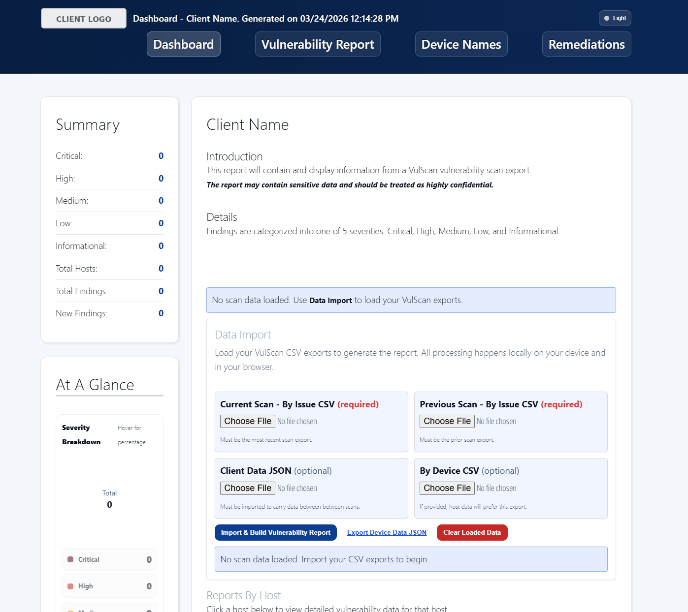
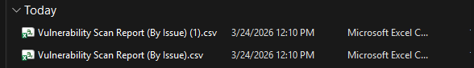
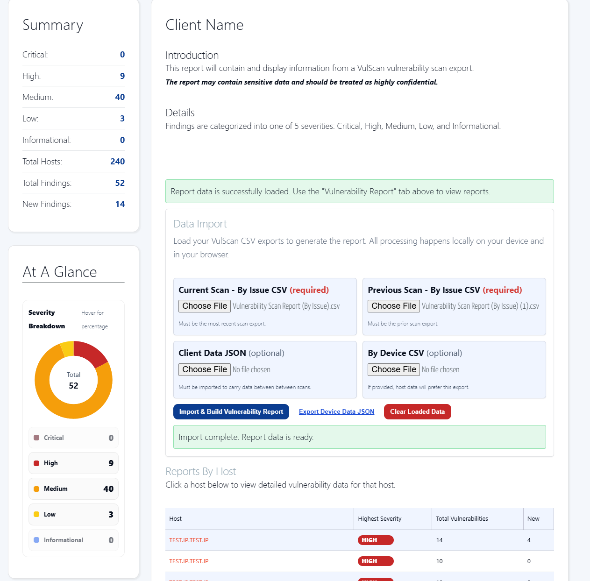
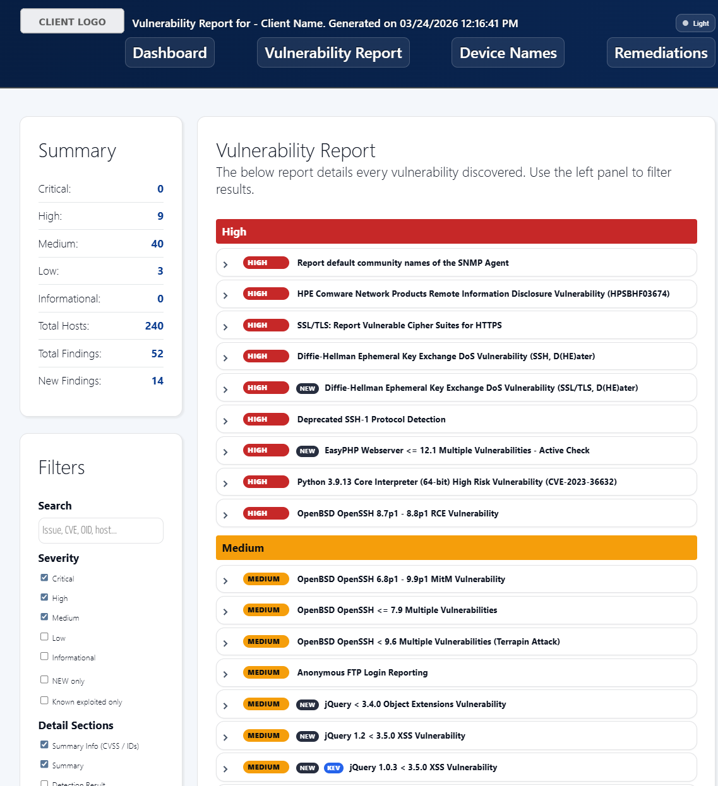
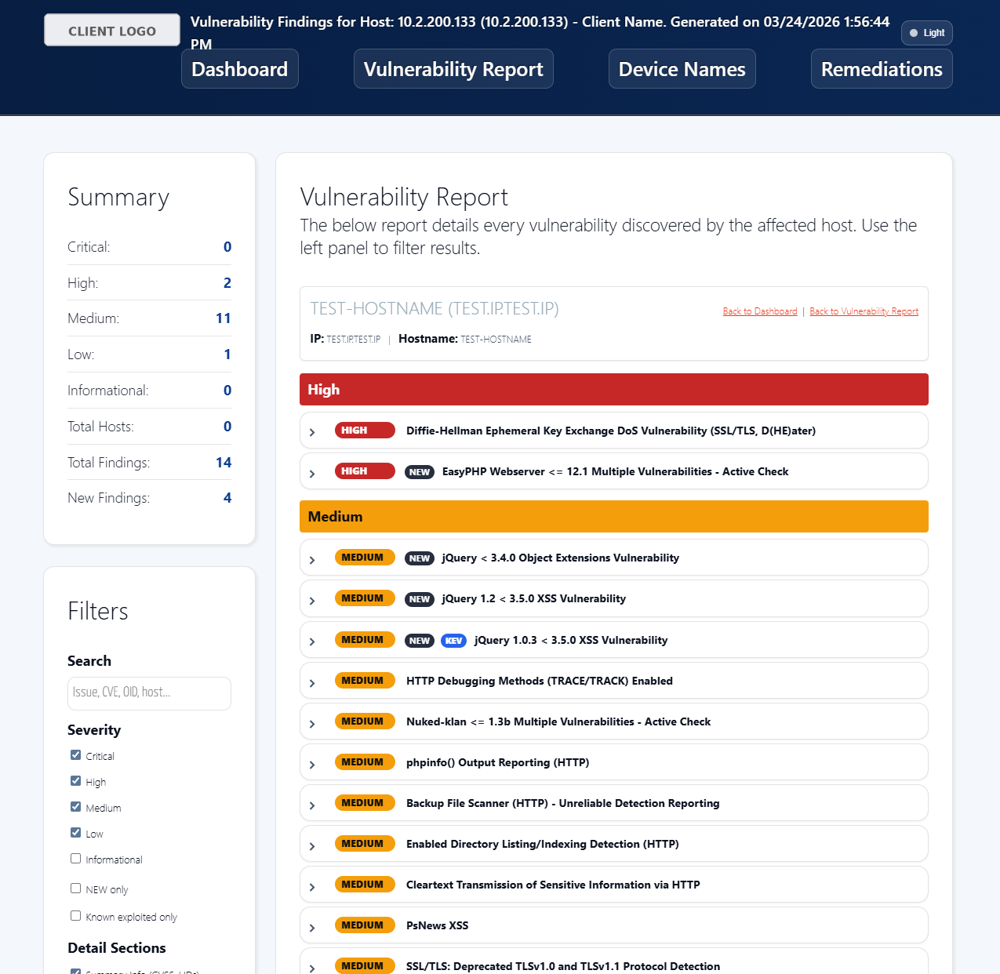
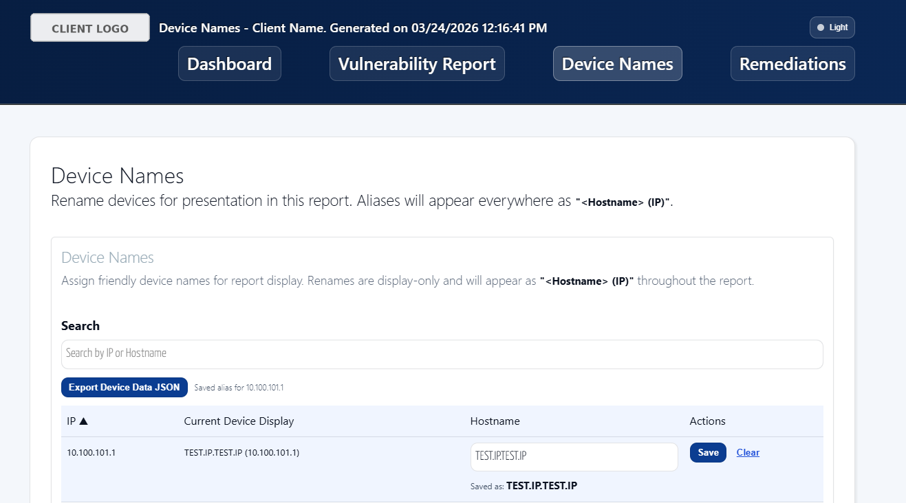

# VulScan Offline Reporter

A portable, browser-based reporting utility for reviewing **RapidFireTools VulScan** exports offline, comparing scan cycles, and carrying analyst context forward from one reporting period to the next in one repeatable dashboard.

This package is intended to be copied, branded for a specific client, and used repeatedly without embedding one client’s identity into the next engagement.

---

## Contents

- [Overview](#overview)
- [What the Tool Does](#what-the-tool-does)
- [How the Application Is Organized](#how-the-application-is-organized)
- [Requirements](#requirements)
- [Client Setup](#client-setup)
- [Usage](#usage)
- [Recommended Operating Models](#recommended-operating-models)
- [Screenshots](#screenshots)
- [Troubleshooting](#troubleshooting)
- [Security and Data Handling](#security-and-data-handling)

---

## Overview

RapidFireTools-VulScan-Report exists to solve a practical operational problem:

- analysts need to distinguish **what is new** from **what already existed**,
- remediation commentary needs to persist across reporting cycles, and
- the entire workflow often needs to remain **local, offline, and client-segregated**.

The application runs entirely in the browser. It does **not** perform scanning. It takes in existing VulScan exports and turns them into a structured review workspace for vulnerability triage, host review, device naming, and remediation tracking.

---

## What the Tool Does

### Core functions

- Imports a **current** and **previous** VulScan **By Issue CSV**
- Identifies **new findings** and newly affected hosts
- Builds a dashboard view of findings and hosts
- Supports both vulnerability-centric and host-centric review
- Allows friendly host naming for cleaner reporting to be carried out through the environment
- Preserves remediation notes across scan cycles per vulnerability
- Tracks disappeared findings through a remediation review queue and mitigations log
- Exports retained working data to JSON for reuse in the next cycle

---

## What This Tool Is Not

This tool is not:

- a vulnerability scanner,
- a ticketing system,
- a multi-user SaaS platform,
- a formal source of record for enterprise remediation workflows, or
- a replacement for a full vulnerability management platform.

---

## How the Application Is Organized

### Dashboard

The Dashboard is the starting point for every session. It is where the user:

- imports the required scan files,
- optionally imports prior client working data,
- builds the active report dataset,
- views scan-level summary statistics, and
- can click on specific hosts for further host-specific information.

### Vulnerability Report

The Vulnerability Report is the main triage workspace for vulnerability-based review, similar to VulScan's "By Issue" filter.

It supports:

- severity filtering,
- search,
- **NEW only** filtering,
- **Known Exploited** filtering,
- selective expansion of detail sections,
- review of affected devices per vulnerability, and
- remediation note entry and save actions at the issue level.

### Host Report

The Host Report is the device-centric drilldown view. It lets the user open a specific host and review only the findings affecting that device, similar to VulScan's "By Device" filter - without having to reload the entire session.

It is useful for:

- validating device-specific exposure,
- supporting host-by-host review meetings,
- checking whether a “new” issue is new for the whole scan or only new to a specific host, and
- documenting notes while staying focused on one device context.

### Device Names

The Device Names page is where the user assigns "friendly" hostname labels for report readability, since VulScan cannot handle this and usually only provides IP addresses.

These aliases are:

- display-only,
- reusable across reporting cycles, and
- stored in the exported JSON so they can be brought back in later.

### Remediation Report

The Remediation Report is the operational follow-through page. It is meant to deal with findings that disappear between scans and therefore require analyst disposition - which VulScan does not have a feature for.

It includes:

- **By Vulnerability** and **By Device** views,
- a **Needs Review** queue,
- a **Mitigations Log**,
- reason codes such as *Mitigated*, *Accepted Risk*, *False Positive*, *Removed Device*, and *Other*,
- bulk review actions, and
- CSV export of the review queue and mitigation log.

---

## Requirements

### Supported environment

- Any OS with a GUI interface  
- Current version of any web browser
- No server, installer, or external dependency required

### Required inputs

| Input | Required | Purpose |
|---|---:|---|
| Current Scan - By Issue CSV | Yes | Primary scan dataset for the reporting cycle |
| Previous Scan - By Issue CSV | Yes | Baseline used to identify new issues and changes |

### Optional but strongly recommended inputs

| Input | Required | Purpose |
|---|---:|---|
| Client Data JSON | No | Re-imports prior notes, device aliases, and remediation history |
| By Device CSV | No | Improves host metadata and host-to-finding mapping |

---

## Client Setup

This package has been sanitized so the client identity can be changed without editing the broader application.

### Step 1: create a client-specific working copy

Start from the sanitized master template as downloaded here and make a dedicated working copy for the target client.

### Step 2: edit the client settings

Update the following file:

js\client-settings.js
```javascript
window.VulScanReportClientSettings = Object.freeze({
  clientName: 'Client Name',
  clientId: '',
  logoFileName: 'companylogo.png',
});
```

### Field guidance

| Field | Required | Description |
|---|---:|---|
| `clientName` | Yes | Human-readable client name shown in report headers |
| `clientId` | No | Unique storage namespace for browser isolation; if left blank it is derived from `clientName` |
| `logoFileName` | No | Logo file stored in the `images/` folder in case image name was changed |

### Step 3: replace the logo

Replace the logo image in the `images/` folder, or update the configured logo filename to match the desired asset.

---

## Usage

This section is written as the primary guide for a new user.

### 1. Launch the application

Open `index.html` in a supported browser. The Dashboard is the landing page.

### 2. Import the reporting inputs

On the Dashboard, load:

- **Current Scan - By Issue CSV**, which is the current scan cycle
- **Previous Scan - By Issue CSV**, which is the previous scan cycle 
- **Client Data JSON** from the last reporting cycle, if previously used and is available
- **By Device CSV**, if available

Then click:

**Import & Build Vulnerability Report**

The application will parse the files locally and build the working dataset.

### 3. Validate the import

After import, confirm:

- the Dashboard summary counts are populated as expected,
- the host list is populated,
- the client branding appears correctly in the page header,
- there are no visible import errors,
- the new findings count looks reasonable relative to the current and previous scans.

If the Dashboard is empty after import, stop there and correct the input files before proceeding.

### 4. Work the Vulnerability Report

Move to the Vulnerability Report for analyst triage.

Recommended process:

1. Start with **Critical** and **High** findings.
2. Use **NEW only** to isolate change since the previous scan. Must have every other filter checked except for **Known Exploited Only** for maximum visibility.
3. Use **Known exploited only** to prioritize issues with active exploitation relevance. Must have every other filter checked except for **New Only** for maximum visibility.
4. Expand the detail sections needed for analysis.
5. Review affected devices for each issue.
6. Enter remediation or analyst notes where useful.
7. Click **Save** on note entries; notes are not saved by typing alone.
8. If there is no other work to be done, make sure to export the Data JSON in the Dashboard to be uploaded in the future to load the data back. 

### 6. Drill into the Host Report when needed

Use the Host Report if you need device-specific information.

Common reasons to use it:

- validating whether a new issue is limited to one device,
- reviewing all exposure for a specific server or workstation,

The Host Report is best used as a drilldown from the Dashboard or Vulnerability Report rather than as the first page of review.

### 7. Normalize device naming

Open the Device Names page once scan data is loaded to add hostname data. If any hostnames are changed, make sure to export the Data JSON to save between scans.

Use it to:

- assign cleaner display names,
- make host review more readable,
- standardize devices that appear inconsistently across exports.

#### Recommended use

Do this early in the lifecycle for recurring clients. Once device aliases are established, every future review becomes easier to read and pinpoint a specific device.

#### Important behavior

Device aliases are display-only. They do not modify the source scan exports. These are also not saved automatically, must be exported as a JSON to be uploaded in the future to load the data back. 

### 8. Use the Remediation Report to track resolution changes (**WORK IN PROGRESS**)

Open the Remediation Report after the current and previous scans have been compared. Be advised this tab is newer and I am still working through bugs.

Use **Needs Review** to process findings that no longer appear and assign a resolution status such as:

- Mitigated
- Accepted Risk
- False Positive
- Removed Device
- Other

Use **Mitigations Log** as the retained history of resolved or dispositioned items captured from this tool.

#### Recommended process

- Start in **By Vulnerability** view for broad issue-level cleanup
- Switch to **By Device** view when device-level remediation is needed
- Use bulk action where many rows share the same resulution status

### 9. Export retained working data before closing (**IMPORTANT**)

Before ending the session, make sure to export the Data JSON.

Depending on the page, the application may label this action as either:

- **Export Device Data JSON**, or
- **Export Client Data JSON**

These export actions preserve the reusable working data that carries forward across reporting cycles, including:

- remediation notes,
- device aliases, and
- resolution tracking state.

#### Critical rule

Do not close the review cycle without exporting the updated JSON.

Browser session state is not the long-term record and will be cleared upon brower refresh.

### 10. Archive the cycle artifacts

At the end of each reporting cycle, store the following together:

- current By Issue CSV,
- exported client JSON,
- any remediation CSV extracts used externally.

That set becomes the starting point for the next review cycle.

---

## Recommended Operating Models

### First cycle for a brand-new client

Use this order:

1. Create a fresh client copy from the sanitized template
2. Configure client name and logo
3. Import current and previous scans
4. Optionally import By Device CSV
5. Build the report
6. Create initial device aliases
7. Add initial vulnerability notes
8. Review remediation queue
9. Export the first client JSON

### Recurring cycle for an existing client

Use this order:

1. Open the client’s existing package copy
2. Import the latest current By Issue CSV
3. Import the prior cycle’s By Issue CSV as the previous baseline
4. Import the most recent exported client JSON
5. Optionally import the latest By Device CSV
6. Rebuild the report
7. Review NEW findings first
8. Update notes, aliases, and remediation state
9. Export the refreshed client JSON
10. Archive the cycle deliverables

---

## Screenshots

The documentation includes placeholder screenshots that can be replaced with finalized images from your client-branded build.

### Initial Dashboard Landing Page



### Import File Dashboard



### Dashboard After Upload



### Vulnerability Report Overview



### Vulnerability Report Full Details


### Host Vulnerability Report



### Device Names Example



### Remediation Report Overview


---

## Troubleshooting

### The app opens but no results appear

Likely causes:

- the CSV format is not the expected VulScan export type,
- the report was not rebuilt after selecting the files.

### Notes or aliases did not carry forward

Likely causes:

- the prior client JSON was not imported,
- the latest session changes were never exported,
- the wrong client package copy is being used.

### Branding is wrong in the header

Check:

- `clientName` in the client settings,
- `logoFileName` in the client settings,
- the matching logo asset in the `images/` folder,
- that the page was refreshed after the change.

### Multiple clients appear mixed together

Check:

- whether the same package copy is being reused for different clients,
- whether `clientId` is unique,
- whether loaded browser state should be cleared before re-importing data.

### The remediation page is empty

The remediation workflow depends on the comparison between current and previous scan data. If that comparison has not been built yet, the page will not have meaningful content.

---

## Security and Data Handling

Although the tool runs locally, the imported files can still contain sensitive operational data such as:

- hostnames,
- IP addresses,
- CVEs,
- vulnerability descriptions,
- remediation commentary.

Treat the working folder, input CSVs, exported JSON, and remediation CSV extracts as client-sensitive artifacts.

